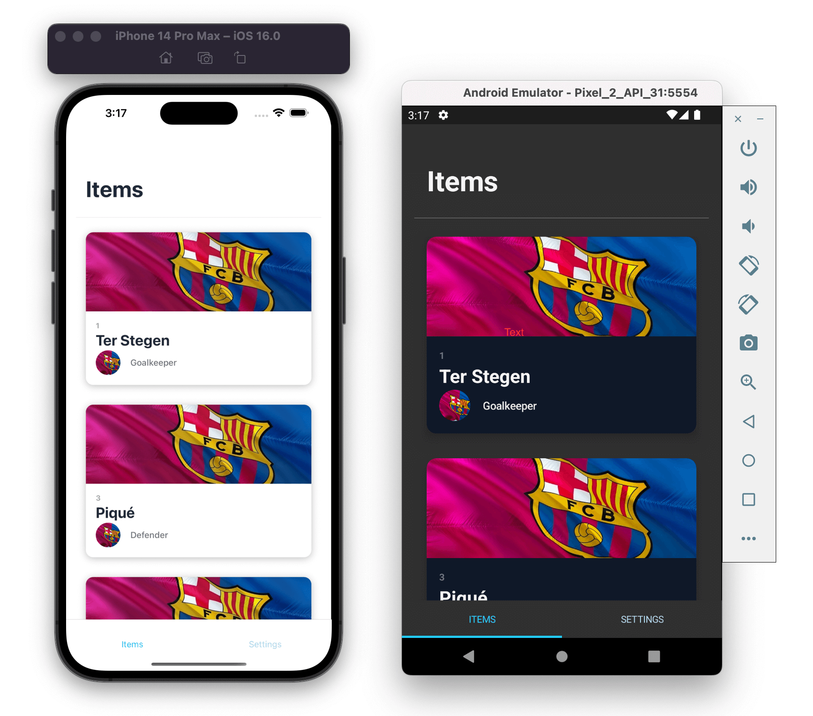

# NativeScript + Tailwind CSS + Angular Mobile Starter

This repo is a small starting point for building a native iOS and Android with Tailwind CSS, [NativeScript](https://nativescript.com/), and [Angular](https://angular.com/).

The app is very much inspired by the [Next.js + Tailwind CSS + Ionic Framework + Capacitor Mobile Starter](https://dev.to/ionic/build-mobile-apps-with-tailwind-css-next-js-ionic-framework-and-capacitor-3kij) and attempts to recreate some of the expericence.

The app currently has the following features:

- Use of Tailwind CSS where applicable including dark mode
- Large Titles with Expanding Action Bar inspired by [https://www.youtube.com/watch?v=S0Xm4B_UPEU](https://www.youtube.com/watch?v=S0Xm4B_UPEU) by [@alexziskind1](https://www.github.com/@alexziskind1)
- Custom Toggle Bar component for setting the appearence inspired by [https://www.youtube.com/watch?v=OS75l9AoKPQ](https://www.youtube.com/watch?v=OS75l9AoKPQ) by [@alexziskind1](https://www.github.com/@alexziskind1)

[Edit on StackBlitz ⚡️](https://stackblitz.com/edit/nativescript-tailwind-angular-starter)